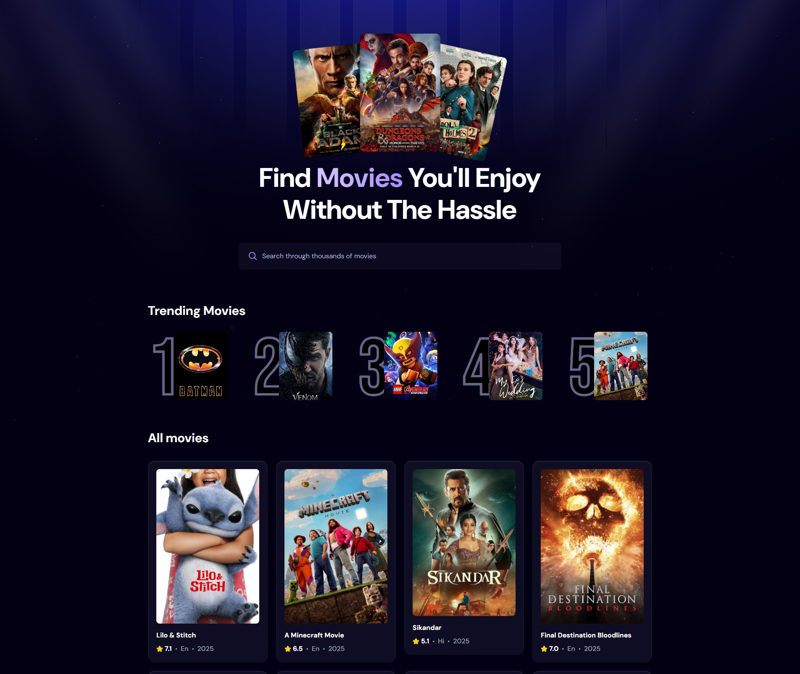

# 🎬 Movie-Finder

**Discover your next favorite movie effortlessly using React, TypeScript, and TMDB.**

[](https://www.typescriptlang.org/)
[](https://vitejs.dev/)
[](https://tailwindcss.com/)
[](https://reactjs.org/)
[](https://www.themoviedb.org/)
[](https://your-vercel-link.vercel.app) <!-- Replace with your real link -->

---



## 🚀 Overview

**Movie-Finder** is a responsive web app that helps users search, discover, and explore movie data in real time — including trailers, overviews, ratings, and more.

### 🔥 Key Features

- 🔍 **Instant Search** powered by TMDB API
- 🎞️ **Trailer Embedding** with YouTube integration
- 🧠 **TypeScript + ESLint** strict code standards
- 🌐 **Responsive UI** with Tailwind CSS
- ☁️ **Appwrite Integration** for backend logic *(optional)*
- 🚀 **Vite** for lightning-fast development experience

---

## ⚙️ Tech Stack

| Tool         | Purpose                        |
|--------------|--------------------------------|
| **React**    | UI framework                   |
| **TypeScript** | Type safety                  |
| **Vite**     | Fast build tool                |
| **Tailwind** | Styling                        |
| **TMDB API** | Movie data                     |
| **Appwrite** | Search analytics / backend     |
| **Vercel**   | Deployment                     |

---

## 📦 Getting Started

### ✅ Prerequisites

Before you begin, make sure you have:

- [Node.js](https://nodejs.org/) installed
- [NPM](https://www.npmjs.com/) package manager

---

### 🧑‍💻 Installation

Clone the repo and install dependencies:

```bash
git clone https://github.com/HammamYousef/movie-finder.git
cd movie-finder
npm install
```

---

### ▶️ Usage

To run the development server locally:

```bash
npm run dev
```

Then visit: [http://localhost:5173](http://localhost:5173)

---

## 🌐 Deployment

The app is deployed using [**Vercel**](https://vercel.com).

🔗 **Live URL**: 

---

## 🧪 Testing

> ℹ️ _Currently no testing framework is configured. Future plans include Vitest or Jest support._

---

## 🛡 License

This project is licensed under the [MIT License](LICENSE).

---

## 🙌 Acknowledgements

- 🎬 [TMDB API](https://www.themoviedb.org/)
- ☁️ [Appwrite](https://appwrite.io/)
- ⚛️ [React](https://reactjs.org/)
- 💨 [Tailwind CSS](https://tailwindcss.com/)
- ⚡ [Vite](https://vitejs.dev/)

> _Built with love by [@HammamYousef](https://github.com/HammamYousef) 💙_